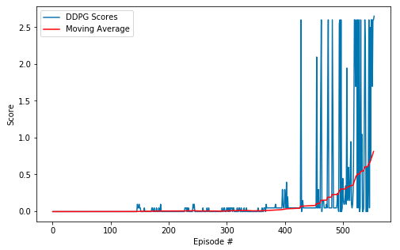
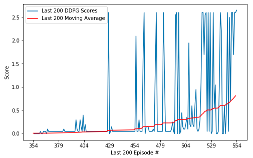
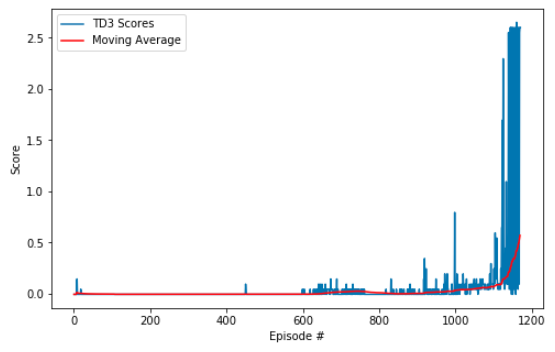
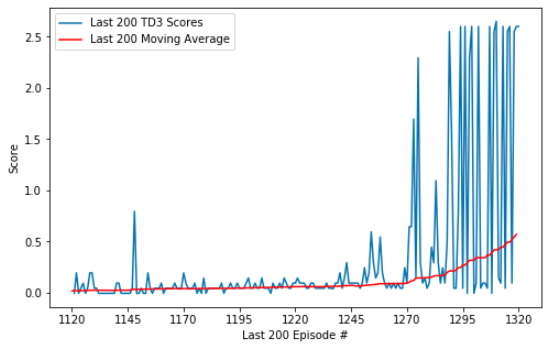
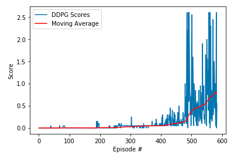
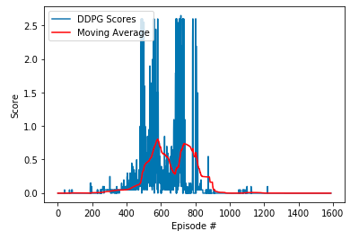
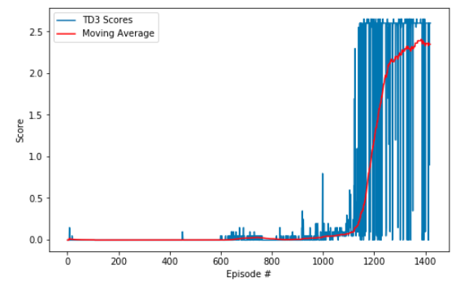
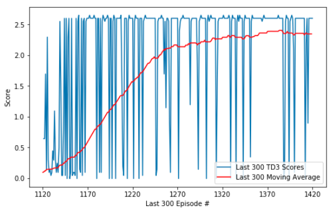

### Udacity Deep Reinforcement Learning Nanodegree (DRLND) - Project 3 - Collaborate and Compete

# Report

See the `readme.md` for background information for the project and how to set up the Unity ML-Agents Reacher environment used. This report contains detail of the **Actor-Critic** learning algorithm and model architecture used to solve the environment, and results of experimentation with the architecture.

## 1. The Learning algorithm 

### Reinforcement Learning Summary
<div>
 
</div>

*The agent-environment interaction in reinforcement learning. (Source: Sutton and Barto, 2017)*

- The reinforcement learning (RL) framework is characterized by an **agent** learning to interact with its **environment**.
- At each time step, the agent receives the environment's **state** (_the environment presents a situation to the agent_), and the agent must choose an appropriate **action** in response. One time step later, the agent receives a **reward** (_the environment indicates whether the agent has responded appropriately to the state_) and a new **state**.
- All agents have the goal to maximize expected cumulative reward, or the expected sum of rewards attained over all time steps.

### Actor-Critic Summary

The **Actor** in an actor-critic model does its best to respond to the environment in order to maximize its reward   

The **Critic** repsonds immediately with feedback on how well the actor is doing

----

In somewhat more detail:

Basic reinforcement learning models are either **Value based** or **Policy based**. The following are excerpts from a [freeCodeCamp](https://www.freecodecamp.org/news/an-intro-to-advantage-actor-critic-methods-lets-play-sonic-the-hedgehog-86d6240171d/) article about this :
- Value based methods (Q-learning, Deep Q-learning): where we learn a value function that will map each state action pair to a value. Thanks to these methods, we find the best action to take for each state — the action with the biggest value. This works well when you have a finite set of actions.
- Policy based methods (REINFORCE with Policy Gradients): where we directly optimize the policy without using a value function. This is useful when the action space is continuous or stochastic. The main problem is finding a good score function to compute how good a policy is. We use total rewards of the episode.

Actor-Critic is a hybrid of these, using two neural networks:
- an Actor that controls how our agent behaves (policy-based)
- a Critic that measures how good the action taken is (value-based)

The Actor-Critic model differs from more elementary learning processes in that instead of waiting until the end of the episode as in Monte Carlo REINFORCE, an update is made at each time step (TD Learning): 
<div>
 
</div>

Because we do an update at each time step, we can’t use the total rewards `R(t)`. Instead, we need to train a Critic model that approximates the value function (the value function calculates what is the maximum expected future reward given a state and an action). This value function replaces the reward function in policy gradient that calculates the rewards only at the end of the episode.

The freeCodeCamp article high-level description uses the idea of a video game play with a friend observing your play and supplying feedback:

Imagine you play a video game with a friend that provides you some feedback. You’re the Actor and your friend is the Critic.
<div>
 
</div>  

##### &nbsp; 

At the beginning, you don’t know how to play, so you try some action randomly. The Critic observes your action and provides feedback.      
    
Learning from this feedback, you’ll update your policy and be better at playing that game.
  
On the other hand, your friend (Critic) will also update their own way to provide feedback so it can be better next time.

----

## 2. The Tennis Agent's State & Action Space

In this environment, two agents control rackets to bounce a ball over a net. If an agent hits the ball over the net, it receives a reward of +0.1.  If an agent lets a ball hit the ground or hits the ball out of bounds, it receives a reward of -0.01.  Thus, the goal of each agent is to keep the ball in play.

The observation space consists of 8 variables corresponding to the position and velocity of the ball and racket. Each agent receives its own, local observation.  Two continuous actions are available, corresponding to movement toward (or away from) the net, and jumping. 

The task is episodic, and in order to solve the environment, the agents must get an average score of +0.5 (over 100 consecutive episodes, after taking the maximum over both agents). 

Specifically,

- After each episode, we add up the rewards that each agent received (without discounting), to get a score for each agent. This yields 2 (potentially different) scores. We then take the maximum of these 2 scores.
- This yields a single **score** for each episode.

The environment is considered solved, when the average (over 100 episodes) of those **scores** is at least +0.5.

<br>
<div>
 
</div>  

Movies of the final trained models can be found in the `readme.md`

##### &nbsp;
----

## 3. Training process overview

### Deep Deterministic Policy Gradient (DDPG)
 
After reviewing the problem I realized that the project could utilize the code of my previously completed Udacity Deep Reinforcement Learning project 2, which was a 20 agent "Reacher" environment that trained agents to reach for balls. That is, I realised that I could take the same approach, since, like Reacher, the Unity environment was giving me multiple agents (two in this case) and that the environment would take care of training them to collaborate and compete with one another provided my code was properly implemented.  

However, unlike the Reacher solution I found that the episodic "update network after every 20 timesteps" utilized there did not work for the Tennis challenge, so for this task I used no training delay strategy.  

I observed that there was a very slow build up process where the scores returned were mostly zero, until a point was reached where suddenly trainng began to show results. My understanding is that the model was firstly accumulating enough experiences, and only after that could it begin the calculate the best experiences.

If overtrained the model completely lost its way and scores plummeted to zero.

### Twin Delayed DDPG (TD3)

The classic DDPG approach, while achieving the goal of an average of 0.5 over 100 episodes, became unstable much after that, and so the maximum score was only around 0.85. 

Therefore, I also trialled a [Twin Delayed DDPG](https://arxiv.org/pdf/1802.09477) (TD3), which differs from classic DDPG by taking the minimum of the mean squared error of _two_ Critic models for the loss calculation, and so minimizes the DDPG tendency to overestimate Q-values - which is what leads to a broken policy. Additionally TD3 utlizes a delay in updating the Policy which also helps stabilize the result.

According to [openai.com](https://spinningup.openai.com/en/latest/algorithms/td3.html):

"While DDPG can achieve great performance sometimes, it is frequently brittle with respect to hyperparameters and other kinds of tuning. A common failure mode for DDPG is that the learned Q-function begins to dramatically overestimate Q-values, which then leads to the policy breaking, because it exploits the errors in the Q-function. Twin Delayed DDPG (TD3) is an algorithm which addresses this issue by introducing three critical tricks:

- *Trick One*: Clipped Double-Q Learning. TD3 learns two Q-functions instead of one (hence “twin”), and uses the smaller of the two Q-values to form the targets in the Bellman error loss functions.

- *Trick Two*: “Delayed” Policy Updates. TD3 updates the policy (and target networks) less frequently than the Q-function. The paper recommends one policy update for every two Q-function updates.

- *Trick Three*: Target Policy Smoothing. TD3 adds noise to the target action, to make it harder for the policy to exploit Q-function errors by smoothing out Q along changes in action.

- Together, these three tricks result in substantially improved performance over baseline DDPG.

- *Quick Facts:*
	- TD3 is an off-policy algorithm.
	- TD3 can only be used for environments with continuous action spaces.
	- The Spinning Up implementation of TD3 does not support parallelization."

---- 

With TD3 it took even longer to get the required goal but I was able to continue training to a moving average score of 2.39, and when training beyond that, although the score did not improve, the model showed no signs of breaking down due to over-training.   
  
##### &nbsp;

<div>
 
</div> 


##### &nbsp;
----

## 4. The final runs
- Training on my Windows 10 PC, with a GTX1080 GPU
- **DDPG**
	- There were 8 runs attempted, initially I had no success, until the correct parameters were determined. 
	- 426 episodes were required to solve the environment, but I trained for a further amount until a score of 0.8 was achieved at 554 episodes 
	- Training time was 23 minutes to 0.5, 39 minutes to 0.8.

__DDPG - Illustration of the long lead-up to getting positive scores...__
    
```
Episode 10 (2 sec)  Current Score: -0.00	Mean Score: -0.00  Moving Average Score: -0.00
Episode 20 (1 sec)  Current Score: -0.00	Mean Score: -0.00  Moving Average Score: -0.00
Episode 30 (1 sec)  Current Score: -0.00	Mean Score: -0.00  Moving Average Score: -0.00
Episode 40 (4 sec)  Current Score: -0.00	Mean Score: -0.00  Moving Average Score: -0.00
Episode 50 (7 sec)  Current Score: -0.00	Mean Score: -0.00  Moving Average Score: -0.00
...
Episode 350 (8 sec)   Current Score: -0.00  Mean Score: -0.00  Moving Average Score: 0.01
Episode 360 (10 sec)  Current Score: -0.00  Mean Score: -0.00  Moving Average Score: 0.01
Episode 370 (16 sec)  Current Score: 0.05   Mean Score: 0.05   Moving Average Score: 0.011
Episode 380 (17 sec)  Current Score: 0.05   Mean Score: 0.05   Moving Average Score: 0.01
Episode 390 (19 sec)  Current Score: 0.05   Mean Score: 0.05   Moving Average Score: 0.02
Episode 400 (30 sec)  Current Score: 0.30   Mean Score: 0.05   Moving Average Score: 0.03
Episode 410 (31 sec)  Current Score: 0.05   Mean Score: 0.15   Moving Average Score: 0.04
Episode 420 (17 sec)  Current Score: 0.05   Mean Score: 0.05   Moving Average Score: 0.04
Episode 430 (71 sec)  Current Score: 0.05   Mean Score: 0.05   Moving Average Score: 0.077
Episode 440 (20 sec)  Current Score: 0.05   Mean Score: 0.15   Moving Average Score: 0.07
Episode 450 (18 sec)  Current Score: 0.05   Mean Score: 0.05   Moving Average Score: 0.08
Episode 460 (68 sec)  Current Score: 0.05   Mean Score: 0.05   Moving Average Score: 0.11
Episode 470 (112 sec) Current Score: 0.05   Mean Score: 0.05   Moving Average Score: 0.15
Episode 480 (102 sec) Current Score: 0.05   Mean Score: 0.05   Moving Average Score: 0.19
Episode 490 (94 sec)  Current Score: 0.10   Mean Score: 0.05   Moving Average Score: 0.23
Episode 500 (181 sec) Current Score: 0.45   Mean Score: 0.25   Moving Average Score: 0.30
Episode 510 (97 sec)  Current Score: 0.60   Mean Score: 0.15   Moving Average Score: 0.33
Episode 520 (141 sec) Current Score: 2.60   Mean Score: 0.20   Moving Average Score: 0.39
Episode 526 (56 sec)  Current Score: 2.60   Mean Score: 2.60   Moving Average Score: 0.51
Environment solved in 426 episodes!	Average Score: 0.51

Episode 530 (327 sec) Current Score: 0.05   Mean Score: 2.60   Moving Average Score: 0.51
Episode 540 (222 sec) Current Score: -0.00  Mean Score: 2.60   Moving Average Score: 0.60
Episode 550 (261 sec) Current Score: 2.60   Mean Score: -0.00  Moving Average Score: 0.72
Episode 554 (57 sec)  Current Score: 2.65   Mean Score: 2.65   Moving Average Score: 0.81
Maximum Score in 554 episodes!	Average Score: 0.81

Elapsed Time: 38.97 mins.
```

*__DDPG Charts of the runs:__*

<div>

</div>

<div>

</div>

- **TD3**
	- This was successful on the first run, using the same parameters as with DDPG. 
	- 1,168 episodes were required to solve the environment, but I was able to train for a further amount until a score of 2.39 was achieved at 1,380 episodes 
	- Training time was 36 minutes to 0.52, 235 minutes to 2.39.

*__TD3 Charts of the runs:__*

<div>

</div>

<div>

</div>
    
## 5. Insights from extended runs

- **DDPG**
	- I observed that further training increased the score up to a point, but any continued training then decreased the accuracy of the Agent, and past 800 episodes this negative effect was extreme, the scores would plummet back towards zero.

	- Run for 600 espisodes
<div>

</div>

	- Run for 1600 espisodes

<div>

</div>

- **TD3**
	- I was able to continue training until the moving average was 2.39 at episode 1,380, which was close to the best score of 2.6, without the model breaking down. 
	- Even when training beyond this mark to 1,420 episodes the model did not lose much, retaining a moving average score of 2.35.  

	- Run for 1,420 espisodes
<div>

</div>

	- Detail of last 300 of the TD3 1,420 espisodes
<div>

</div>


##### &nbsp;  
----

## 6. Model architecture and parameters
**DDPG**
The [Model code](model.py) is located in `model.py`

- Model Architecture
    - An Actor and a separate Critic neural networks, with 3 fully connected layers 
    - Parameters:
        - state_size 
        - action_size
        - seed
        - fc1_units=400
        - fc2_units=300
        - leakiness=0.01  
    - Layer one took state_size as an input and output fc1_units
    - Layer two took fc1_units and output fc2_units
    - Layer three took fc2_units and output action_size
    - The best activation function was a leaky_relu
    - If leakiness > 0 then leaky_relu used with leakiness as slope, else relu
    - Gradient Clipping was an important component to stablilize learning
    - Batch normalization was applied to the first layer only
    - Forward returns via `tanh` for the Agent, directly from layer 3 for the Critic

**TD3**
The [Model code](td_ddpg_model.py) is located in `td_ddpg_model.py`

- Model Architecture
    - As with DDPG, but with two Critic neural networks
    - The Q-score used was the minimum of the two Critic models
    - Batch normalization was not required (and in fact hindered)
    - Time Delay on Policy update (Policy updates only every second episode)
    - Architecture was based on the code avaliable in the Udemy [Deep Reinforcement Learning 2.0](https://www.udemy.com/course/deep-reinforcement-learning) course, which I took in order to understand this model. 

UdemyUdemy) 
     
----

## 7. Agent architecture and hyperparameters
**DDPG**  
- The [Agent code](ddpg_agent.py) is located in `ddpg_agent.py`
  
**TD3**   
- The [Agent code](td_ddpg_agent.py) is located in `td_ddpg_agent.py`

- Key components of the Agents:
    - Utlization of the Actor and Critic neural networks
    - Experience Replay buffer 
        - Shared between the 2 agents so they can learn from each other
        - The buffer contains experiences tuples of state, action, reward, next state and done
        - Repeated passes through the buffer allows the Agent to learn from experiences
- Hyperparameters are defined in ddpg_agent (or td_ddpg_agent for TD3)
    - Sensitive to `buffer_size` (larger was required), `batch_size`, tau` and `ou_sigma` especially - these required different settings compared to `Reacher`
    - Otherwsise, the defaults were mostly the best settings
- In the notebook, we set SEED which is utilized throughout whenever a random seed needs initializing, the model was sensitive to the seed value

```
BUFFER_SIZE = int(2e5)  # replay buffer size
BATCH_SIZE = 1024       # minibatch size    
GAMMA = 0.99            # discount factor   
TAU = 2e-3              # for soft update of target parameters   
LR_ACTOR = 1e-3         # learning rate of the actor             
LR_CRITIC = 1e-3        # learning rate of the critic            
OPTIM = 'Adam'          # optimizer to use                       
WEIGHT_DECAY = 0        # L2 weight decay                        - default for Adam = 0
LEAKINESS = 0.01        # leakiness, leaky_relu used if > 0      - default for leaky_relu is 0.01
LEARN_EVERY = 20        # learning timestep interval
LEARN_NUM   = 10        # number of learning passes

GRAD_CLIPPING = 1.0     # Gradient Clipping                      

### Ornstein-Uhlenbeck noise parameters
OU_SIGMA  = 0.01        
OU_THETA  = 0.15        
# 
EPSILON       = 1.0     # for epsilon in the noise process (act step)
EPSILON_DECAY = 1e-6    # decay rate (learn step), default 1e-6, 0 for no decay
```

## 8. Conclusion

The Time Delayed DDPG model was clearly superior in that it remained stable and was able to be trained much more that the DDPG model. When oberving the behaviour of the models (see movies in the readme.md) the TD3 model uses very little movement to get the ball going back and forth - it has obviously figured out an optimal approach. The longer time to reach the target is indicative of its approach to avoid overestimation, but is not a problem per se.  
  
##### &nbsp;
---- 

## 9. Ideas for future work
-  **Prioritized experience replay** 
    - Replace random selections of the replay buffer with [prioritized experience replay](https://arxiv.org/abs/1511.05952) - where potentially more important experiences are sampled, even if they do not occur frequently. 
    - I did a lot of work to implement this, without sucess. Along the way came accross [this gem](https://pytorchscholarsdrlnd.slack.com/archives/CM3M49SVA/p1569168263018100?thread_ts=1569079301.017600&cid=CM3M49SVA) from the Udacity DRLND slack channel: _"It seems like it won't work if your training is unstable. The priority depends on the TD error and if your model is not working well, you'll have big errors (I'm talking errors in the millions), giving priority to unstable samples (big gradients that have to be clipped). Maybe I'll try later if I get a more stable training loop (I haven't solved the environment yet)"_.
- **Try other architectures** 
    - The suggested approach for this problem was the [Multi-Agent](https://arxiv.org/abs/1706.02275) Deep Deterministic Policy Gradient ([MADDPG]( https://github.com/openai/maddpg)) algorithm, I should try that.
    - [Proximal Policy Optimization](https://openai.com/blog/openai-baselines-ppo/) (PPO) may be more reliable. The linked article desribes how PPO this approach is better than standard policy gradient methods.